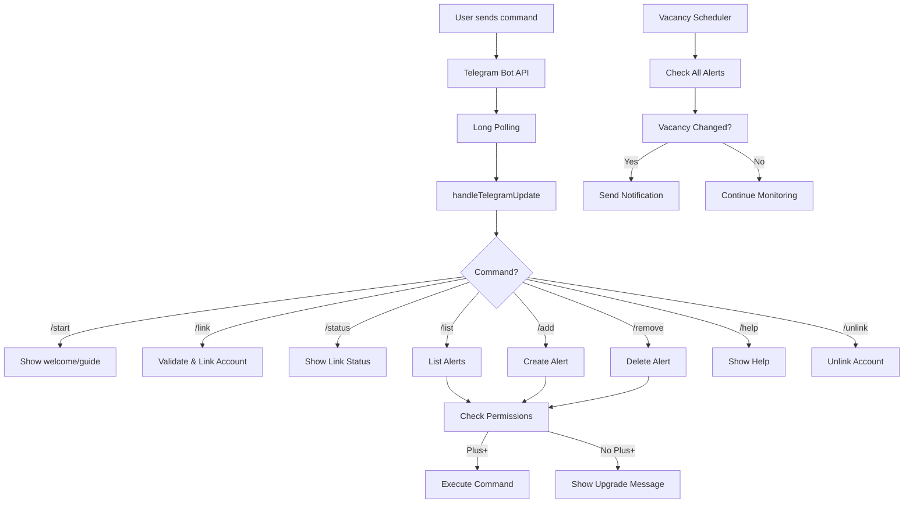

# Telegram Bot - Vacancy Alerts

## Overview

The NTU Mods Telegram bot provides real-time vacancy alerts for NTU course registration. Users can link their accounts, manage alerts, and receive instant notifications when course vacancies become available.

## Features

### Account Linking
- Secure linking via one-time codes
- Automatic permission verification
- Role-based access control (Plus+ required)

### Alert Management
- Add vacancy alerts for specific modules and indexes
- List all active alerts
- Remove alerts when no longer needed
- Real-time vacancy checking

### Notifications
- Instant notifications when vacancies open
- Automatic vacancy tracking
- Singapore timezone awareness

## Commands

### For Everyone

#### `/start`
Shows welcome message and detailed linking guide. If user is not linked or doesn't have sufficient permissions, provides web app URL and instructions.

**Response:**
- Unlinked users: Comprehensive linking guide with web app URL
- Linked users without Plus+: Permission upgrade message with web app URL
- Linked users with Plus+: Confirmation message

#### `/link <CODE>`
Links your Telegram account to your NTU Mods account using an 8-character code.

**Usage:**
```
/link ABC12345
```

**Response:**
- Success: Welcome message with role status
- Failure: Error message (invalid/expired code, already linked)

#### `/status`
Shows your current account link status and role permissions.

**Response:**
- Unlinked: Message with linking guide
- Linked: Account name, role, and alert access status

#### `/help`
Displays all available commands and their descriptions.

#### `/unlink`
Unlinks your Telegram account from NTU Mods. Your alerts will be removed.

**Response:** Confirmation message

---

### For Plus+ Subscribers

#### `/list`
Lists all your active vacancy alerts with current vacancy information.

**Response:**
- No alerts: Helpful message with `/add` example
- With alerts: Numbered list of modules, indexes, and current vacancies

**Example output:**
```
Your Vacancy Alerts

1. CE2002 - Index 10241 (Vacancy: 5)
2. MH1810 - Index 20167 (Vacancy: 0)
3. EE3104 - Index 30456 (Vacancy: 12)

Use /remove NUMBER to delete an alert.
Example: /remove 1
```

#### `/add <MODULE_CODE> <INDEX_NUMBER>`
Adds a new vacancy alert for a specific module and index number.

**Usage:**
```
/add CE2002 10241
/add MH1810 20167
```

**Validation:**
- Module code: 2-3 letters + 4 digits + optional letter (e.g., CE2002, MH1810A)
- Index number: Exactly 5 digits (e.g., 10241)

**Response:**
- Success: Confirmation with module info and current vacancy
- Failure: Error message (invalid format, duplicate alert, module not found)

#### `/remove <NUMBER>`
Removes a vacancy alert by its position number from `/list`.

**Usage:**
```
/remove 1
/remove 3
```

**Workflow:**
1. Use `/list` to see your alerts with numbers
2. Use `/remove <NUMBER>` to delete the alert at that position

**Response:**
- Success: Confirmation with removed module info
- Failure: Error message (invalid number, alert not found)

---

## Permission Requirements

### User Roles
- **User**: Cannot use bot features (redirected to web app)
- **Plus+**: Full access to all bot commands
- **Pro**: Full access to all bot commands
- **Admin**: Full access to all bot commands
- **Superadmin**: Full access to all bot commands

### Access Control
The bot enforces role-based permissions:
- Unlinked users are guided to link via web app
- Users without Plus+ subscription are informed to upgrade
- Plus+ and above can manage alerts

---

## Setup Guide

### 1. Prerequisites
- NTU Mods account (Plus+ subscription required for alerts)
- Telegram account

### 2. Configuration

Set these environment variables in `backend/.env`:

```env
# Enable the Telegram bot
TELEGRAM_BOT_ENABLED=true

# Bot token from @BotFather
TELEGRAM_BOT_TOKEN=your_bot_token_here

# Polling interval (seconds)
TELEGRAM_BOT_POLL_INTERVAL_SECONDS=2

# Vacancy check interval (seconds)
VACANCY_ALERTS_CHECK_INTERVAL_SECONDS=300
```

### 3. Get Bot Token
1. Open Telegram and search for `@BotFather`
2. Send `/newbot` and follow instructions
3. Copy the token and add to `.env`

### 4. Start the Bot
```bash
cd backend
npm run dev
```

The bot will start automatically if `TELEGRAM_BOT_ENABLED=true`.

---

## Linking Flow

### User Journey

1. **User sends `/start` to bot**
   - Receives welcome message with web app URL
   - Instructions on how to link account

2. **User visits web app**
   - Signs in to NTU Mods account
   - Navigates to Vacancy Alerts page
   - Clicks "Link Telegram" button
   - Generates 8-character code (valid for 10 minutes)

3. **User sends code to bot**
   ```
   /link ABC12345
   ```
   - Bot validates code
   - Links Telegram chat ID to user account
   - Confirms linking and shows role status

4. **User manages alerts**
   - `/list` - See all alerts
   - `/add MODULE INDEX` - Add new alert
   - `/remove NUMBER` - Remove alert

5. **User receives notifications**
   - Bot checks vacancies periodically
   - Sends message when vacancy opens
   - Updates continue until user removes alert

---

## Technical Architecture

### Components

```
backend/src/telegrambot/
├── index.ts              # Bot bootstrapper, polling loop
├── handlers.ts           # Command handlers
├── messages.ts           # Message templates
├── telegramClient.ts     # Telegram API client
├── config.ts             # Configuration
└── vacancyScheduler.ts   # Periodic vacancy checker
```

### Flow Diagram



### Database Schema

```prisma
model User {
  telegramChatId     String?   @unique
  telegramUsername   String?
  telegramLinkedAt   DateTime?
  vacancyAlertTasks  VacancyAlertTask[]
}

model TelegramLinkToken {
  id         String   @id @default(uuid())
  userId     String
  code       String   @unique
  expiresAt  DateTime
  usedAt     DateTime?
  createdAt  DateTime @default(now())
}

model VacancyAlertTask {
  id             String   @id @default(uuid())
  userId         String
  moduleCode     String
  indexNumber    String
  lastVacancy    Int?
  lastCheckedAt  DateTime?
  createdAt      DateTime @default(now())
  updatedAt      DateTime @updatedAt
}
```

---

## Error Handling

### Common Errors

| Error | Cause | Solution |
|-------|-------|----------|
| `Link code is invalid or expired` | Code not found, used, or expired | Generate new code |
| `Telegram account is already linked` | Chat ID already linked | Use `/unlink` first |
| `This alert already exists` | Duplicate module + index | Check `/list` |
| `Module code is invalid` | Wrong format | Use format: CE2002 |
| `Index number is invalid` | Not 5 digits | Use format: 10241 |
| `Alert task not found` | Wrong number in `/remove` | Use `/list` to see numbers |
| `Insufficient Permissions` | User role below Plus+ | Upgrade account |

### Logging

All bot operations are logged:
```typescript
logger.info('[TelegramBot] Started');
logger.warn('[TelegramBot] Link failed', { chatId, error });
logger.error('[TelegramBot] Remove alert failed', { chatId, alertIndex, error });
```

---

## Testing

### Manual Testing Checklist

- [ ] Send `/start` when not linked
- [ ] Send `/start` when linked without Plus+
- [ ] Send `/start` when linked with Plus+
- [ ] Generate link code and link account
- [ ] Check `/status` shows correct info
- [ ] Use `/list` with no alerts
- [ ] Add alert with `/add MODULE INDEX`
- [ ] List alerts shows new alert
- [ ] Add duplicate alert (should fail)
- [ ] Remove alert with `/remove NUMBER`
- [ ] Remove invalid number (should fail)
- [ ] Unlink account with `/unlink`
- [ ] Try commands after unlinking

### Test Commands

```bash
# In Telegram bot
/start
/link ABC12345
/status
/list
/add CE2002 10241
/add MH1810 20167
/list
/remove 1
/list
/help
/unlink
```

---

## Deployment

### Production Considerations

1. **Security**
   - Keep bot token secret
   - Use HTTPS for webhook (if switching from polling)
   - Validate all user input

2. **Performance**
   - Adjust polling interval based on server load
   - Optimize vacancy checks (batch processing)
   - Consider webhook mode for high traffic

3. **Monitoring**
   - Log all bot operations
   - Track command usage metrics
   - Monitor API rate limits

4. **Scalability**
   - Current: Long polling (simple, works for small scale)
   - Future: Webhook mode (better for high volume)
   - Consider queue system for notifications

---

## Future Enhancements

### Planned Features
- [ ] Inline keyboards for interactive menus
- [ ] Bulk alert management
- [ ] Alert pause/resume
- [ ] Custom notification preferences
- [ ] Alert sharing with friends
- [ ] Vacancy history charts

### Technical Improvements
- [ ] Switch to webhook mode
- [ ] Add rate limiting per user
- [ ] Implement notification queue
- [ ] Add unit tests
- [ ] Add integration tests

---

## Troubleshooting

### Bot Not Responding

**Check:**
1. `TELEGRAM_BOT_ENABLED=true` in `.env`
2. Valid `TELEGRAM_BOT_TOKEN`
3. Server is running
4. Check logs for errors

**Solution:**
```bash
# Restart backend
cd backend
npm run dev

# Check logs
tail -f logs/combined.log | grep TelegramBot
```

### Link Code Not Working

**Check:**
1. Code not expired (10 min validity)
2. Code not already used
3. User not already linked

**Solution:**
- Generate new code from web app
- Try `/unlink` if already linked

### Commands Not Working

**Check:**
1. Account is linked (`/status`)
2. User has Plus+ subscription
3. Command syntax is correct

**Solution:**
- Send `/help` for command list
- Verify role in web app
- Check error message for details

---

## Support

For issues or questions:
1. Check this documentation
2. Review backend logs
3. Test with `/help` command
4. Check user permissions in database

## License

Part of the NTU Mods project. See main README for license information.
