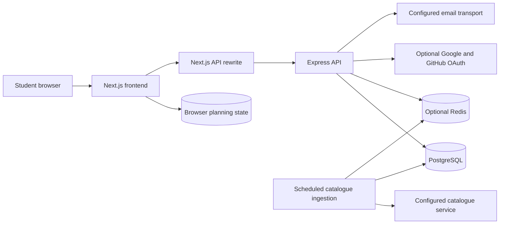
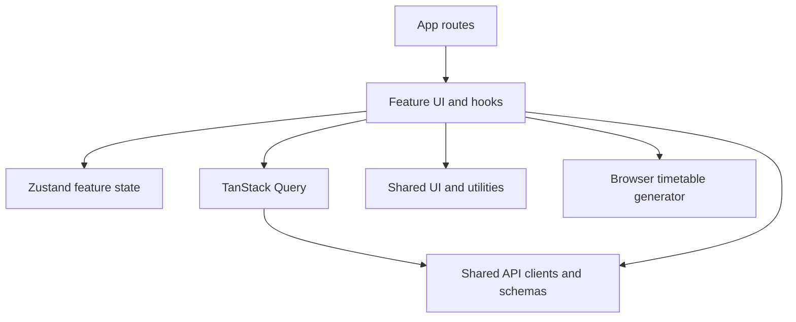
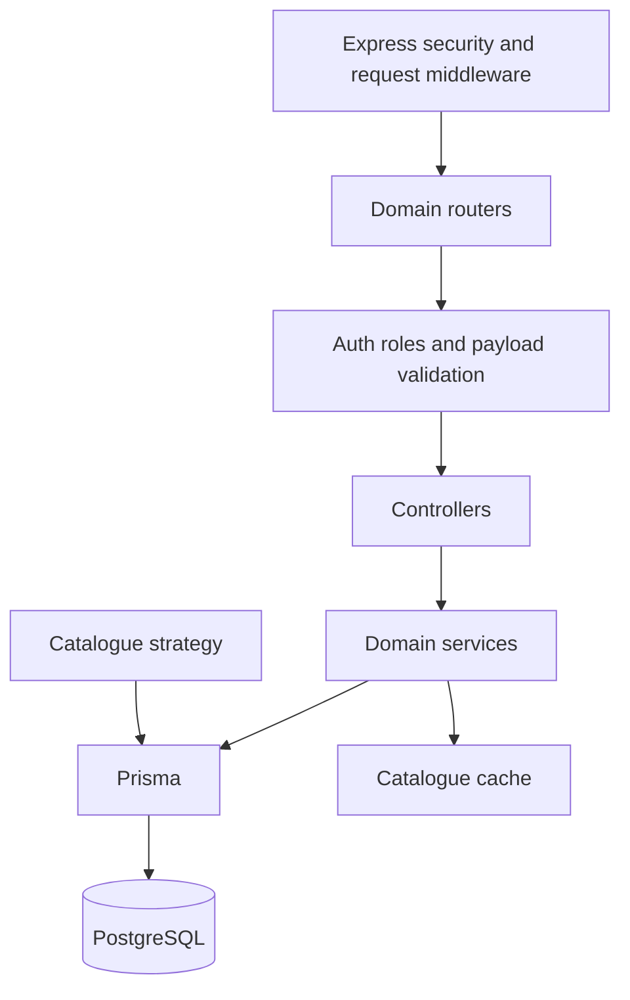

# Architecture

## Runtime components

NTU Mods by Bob uses two separately started services in an npm workspace. The Next.js App Router frontend renders pages and owns browser-local planning state. Express serves account, catalogue, plan, community, and administrative APIs. Prisma connects Express to PostgreSQL; Redis optionally caches catalogue reads.

The frontend calls `/api` by default. `frontend/next.config.ts` rewrites that prefix to `BACKEND_API_URL`, which must include the backend `/api` path. An absent rewrite target yields no proxy rewrite. Public browser variables are embedded by Next.js; backend and OAuth secrets remain server-side.

## Repository map

| Path | Responsibility |
| --- | --- |
| `frontend/src/app` | Route segments, layouts, providers, loading/error/not-found boundaries |
| `frontend/src/features/course-planner` | Roadmap editing, CSV, local state, account sync, grade/AU calculations |
| `frontend/src/features/timetable-planner` | Index selection, filters, local generation, comparison, presets, image export |
| `frontend/src/features/module-info` | Search/details, prerequisites, reviews, topics |
| `frontend/src/features/auth` | Account dialogs, auth store, OAuth/provider initialization |
| `frontend/src/features/admin` | Role-controlled user management |
| `frontend/src/features/planner` | Shared timetable-selection/custom-event state |
| `frontend/src/shared/api` | Axios client, schemas, error normalization, domain clients |
| `frontend/src/shared/data` | TanStack Query provider, keys, queries |
| `frontend/src/shared/ui` | Reusable primitives and timetable displays |
| `backend/src/api/routes` | HTTP paths, route middleware, body validation |
| `backend/src/api/controllers` | HTTP parsing and response orchestration |
| `backend/src/business/services` | Account, catalogue, planning, community, and user rules |
| `backend/src/data` | Catalogue strategy, external API mapping/parsing/persistence |
| `backend/src/config` | Environment, database, Redis/cache, HTTP agents, logging, uploads |
| `backend/src/jobs` | Scheduled catalogue ingestion |
| `backend/prisma` | Current schema and immutable migrations |
| `backend/src/docs` | API index and runtime Swagger/OpenAPI definitions |
| `docs` | Consolidated product/developer/operator references |

## Frontend boundaries

Routes are thin composition points. Hooks orchestrate search, selections, saving, and generation. API payloads are validated with Zod at client boundaries. TanStack Query defaults to one read retry, no focus refetch, a 60-second stale time, and no mutation retries. These defaults do not guarantee upstream freshness.

`auth-storage` persists application identity state. Its version upgrade drops older persisted profiles before `/auth/me` reloads them. `course-planner-storage` persists roadmap modules, metadata, and the last saved module snapshot; its version upgrade immediately rewrites older records with only supported fields, and its merge function restores that same allowlist. `planner-storage` retains selected timetable modules, semester, custom events, and shared planner state. Clearing browser storage loses unsaved local work.

## Backend boundaries

`createApp()` configures Helmet, CORS, JSON/form parsing, optional compression, request IDs, logging, rate limits, routes, optional Swagger, not-found handling, and centralized errors. `server.ts` connects runtime services and starts the configured sync job. Importing the application factory alone does not start scheduled ingestion.

Role comparisons use the existing hierarchy: `user/default`, `plus`, `pro`, `premium`, `admin`, `superadmin`. Unknown roles normalize to `user`. Ownership and administrative restrictions must be enforced by services as well as UI gates. The role vocabulary is retained for compatibility, without introducing payment workflows.

The root-mounted planner router applies authentication to its group. Because it precedes user/generation routers, an unmatched path can pass through that authentication before reaching a later route or the final not-found handler. A route annotation alone is not proof of anonymous reachability.

## Data model

| Model group | Stored information | Important constraints |
| --- | --- | --- |
| `User` | Application identity, password hash, role, OAuth accounts, avatar, preferences/privacy | Unique email; password hash nullable for OAuth-only users |
| Verification/recovery records | Hashed codes/tokens, expiration/use state, email-change workflow | Account-linked records and expiry rules |
| `Module` / `Index` | Catalogue metadata, semester-specific class sessions, exams, prerequisites | Catalogue code/semester relationships; normalized schedules |
| `CoursePlan` | Module roadmap JSON and optional metadata | Unique user ID; one plan per user |
| `Timetable` | Named presets with JSON selections | User-owned records; named-preset service checks |
| Reviews/topics/votes | Community content, ratings, moderation and vote metadata | Author ownership; normalized module code; relevant uniqueness constraints |

The current Prisma schema is authoritative for generated client types. Migrations were applied to isolated PostgreSQL 16 and compared against the current schema with Prisma migrate diff; no drift remained. A populated upgrade fixture preserved roadmap/account data while removing obsolete fields. Production migration and restore verification remain separate.

The scope-reduction migration removes obsolete completion targets and seat-cache fields and filters stored profile settings to supported top-level UI preferences. The application additionally validates and sanitizes nested preferences. Original migrations are preserved to avoid invalidating checksums on existing installations.

## Key flows

### Catalogue ingestion and reads

1. The sync job selects `ExternalApiStrategy` through `DataSourceFactory`.
2. The client calls configured `/health`, `/semesters`, `/course-content`, `/course-schedule`, and `/exam-timetable` endpoints. Paged content/schedule/exam reads use `limit=500` and `offset` with `{ rows, count }` responses; the configured API key is sent as a Bearer authorization header.
3. Records are grouped, normalized, and persisted as modules and class sessions. Missing exam data can be tolerated.
4. A successful sync invalidates the catalogue cache prefix.
5. Catalogue HTTP requests read stored database data, optionally using cache; they do not perform student-account requests.

### Roadmap persistence

1. User edits update the local course store.
2. Account initialization requests `/api/plan`; an account without a stored row gets `{ modules: [], metadata: {} }`.
3. Saving posts modules/metadata. The service upserts by authenticated user ID.
4. After successful saving, the module snapshot is marked saved. The current dirty check compares module content; metadata-only dirty detection is not implemented.

### Timetable generation

The browser hook groups class sessions by module/index, narrows explicitly selected indexes, and invokes the local generator. The generator enumerates compatible selections, filters/scorers results, and returns at most 100. Selecting a result updates the displayed indexes. Custom events are stored/displayed separately and are not currently passed into that generation input.

Two backend API families also exist: `/api/timetable/*` for combination generation/validation and `/api/timetables/*` for saved-preset operations plus another generation interface. They use separate services/contracts. Keep the distinction explicit; browser/API parity is not demonstrated.

### Account profile

Application login obtains cookies and can support bearer-token clients. The profile endpoint returns public account fields, `hasPassword`, and sanitized supported settings. Profile updates validate preference shapes and filter existing settings before merging. Arbitrary stored keys do not become a public profile contract.

## Change rules

Change source definitions rather than generated clients or build output. Propagate route/config/schema changes through consumers, tests, API docs, PRD status, and this reference. Introduce new database changes through reviewed forward migrations. Do not collapse separate generator contracts or widen profile settings without an explicit requirement and validation plan.
